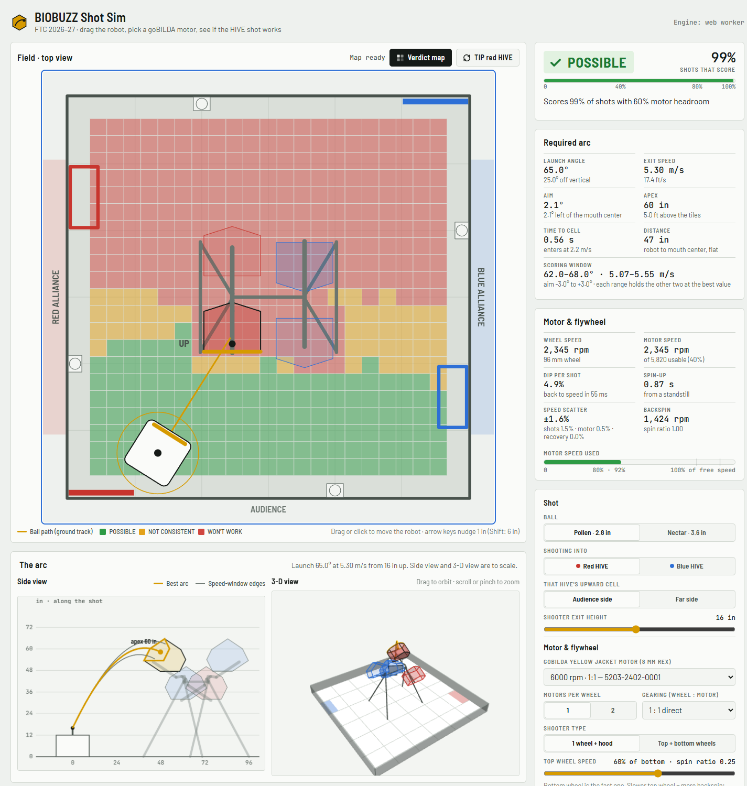
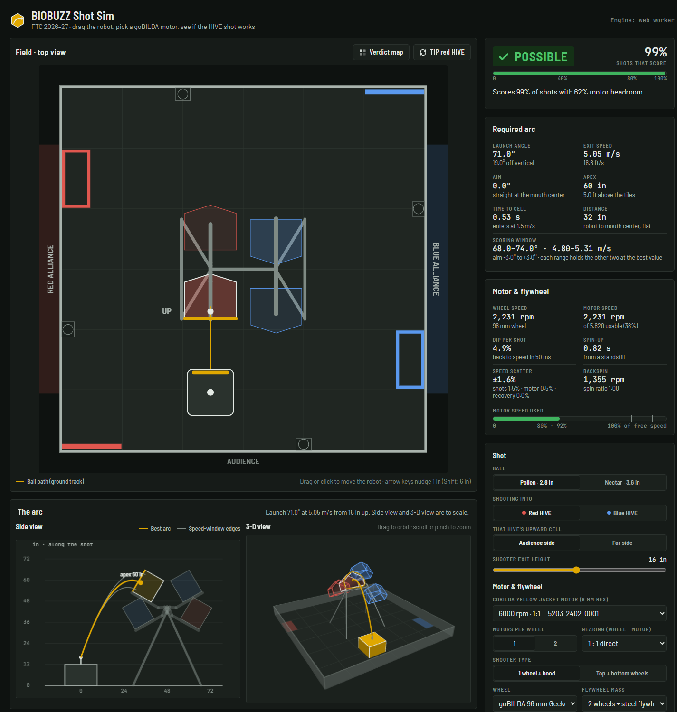

# BIOBUZZ Shot Sim

**Try it: https://lilrino71.github.io/biobuzz-shot-sim/**

A shot simulator for the **FTC 2026–27 game BIOBUZZ**. Drag a robot anywhere on the field and pick a goBILDA Yellow Jacket motor and flywheel setup. The sim finds the arc that puts POLLEN or NECTAR into your alliance's upward HIVE CELL, then gives exactly one of three answers:

| Verdict | Meaning |
|---|---|
| **POSSIBLE** | At least 80% of shots score and the motor runs under 92% of its free speed |
| **NOT CONSISTENT** | 40–80% of shots score, or the motor is close to its limit |
| **WON'T WORK** | No clean arc exists, the motor can't reach the speed, or fewer than 40% score |



## Features

- **Robot anywhere:** drag or click on a to-scale top view of the field (141 in between walls), or type x / y. Arrow keys nudge the robot.
- **Every goBILDA 5203 Yellow Jacket motor** (8 mm REX shaft), 6000 rpm down to 30 rpm, with a side-by-side table for the current spot. The table shows the gear-up each motor would need.
- **Shooter setups:** one wheel + hood, or top + bottom wheels with adjustable backspin. Also adjustable: wheel size, gearing, 1 or 2 motors, flywheel mass, time between shots and exit efficiency.
- **Verdict map:** colors the whole field by verdict for your current settings.
- **The required arc:** launch angle, exit speed, aim, apex, time to the CELL and the scoring window, plus a side view and a 3-D view drawn to scale.
- **TIP button:** the upward CELL flips sides after every TIP, just like in a match.
- **Warnings:** the robot overlapping a HIVE frame leg, or a tall shooter sitting under a HIVE that can swing down onto it.
- Light and dark themes. Physics runs in a Web Worker, with a main-thread fallback.



## How the model works

**Ball flight.** Each shot is integrated with RK4 (2.5 ms steps) in the vertical plane of the launch heading. The model includes quadratic air drag (C_D = 0.45) and backspin lift (C_L = 0.20 · min(spin ratio, 1)). Both values are measured for 26-hole pickleball-style balls, which is what POLLEN (2.80 in, 24.9 g) and NECTAR (3.62 in, 41.3 g) are.

**HIVE geometry.** Each CELL is a pentagonal prism, 20 × 14 in and 12.04 in deep, on a HIVE arm tilted 30° around a pivot 43.95 in up. The geometry reproduces the manual's published mouth heights (53.5 in lip, 65.6 in top). A shot only counts if the ball passes cleanly through the open end. Touching the rim, the roof, the frame legs, the arm bar, another CELL, a wall or the floor is a miss, and nothing bounces in.

**Hit rate.** Real robots scatter every shot. The sim treats launch angle, aim and exit speed as independent Gaussians (σ from the precision setting: Dialed-in, Typical or Rough). It searches a trajectory table for scoring shots, refines around the best aim point, and reports the fraction of scattered shots that still score.

**Motor and flywheel.**
- Exit speed is η × wheel surface speed: η = 0.45 for a hooded single wheel, 0.90 × the average for two wheels.
- Motor headroom is the required rpm ÷ 97% of the listed free speed. goBILDA tests the 1:1 motor at 5,800 of 6,000 rpm.
- Each shot drains 2 × the ball's kinetic energy (linear + spin) from the flywheel.
- Recovery follows the motor's torque-speed line at full power.
- Low headroom or incomplete recovery between shots adds speed scatter, which lowers the hit rate.

Main assumptions: C_D and C_L come from pickleball studies; exit efficiency is adjustable because real hooded shooters measure 0.30–0.45; wheel inertias are estimates (±25%); field tolerances are ±1 in.

## Run it

Use the live page above, or open `dist/preview.html` (or `docs/index.html`) in a browser. No install and no server needed.

```bash
node tools/build.mjs                      # rebuild dist/ from src/ and data/
node --test tests/engine.test.mjs         # unit tests (geometry, flight, motor model, verdicts, symmetry)
python tests/crosscheck/oracle.py --selftest
node tests/crosscheck/compare.mjs         # engine vs. independent Python oracle
```

Requires Node 18+ and, for the cross-check, Python 3 with numpy.

**Cross-check.** `tests/crosscheck/oracle.py` is a separate Python implementation of the same geometry and physics. It uses 0.5 ms steps and checks for collisions everywhere, with no shortcuts. `compare.mjs` fires 3,300 shots across 22 situations: both alliances, both tilt states, both balls, walls, corners, under the pivot and both shooter types. The engine and oracle agree on **99.7%** of shots. Every disagreement is a boundary shot that flips when angle changes by 0.25° or speed by 0.5%.

## Layout

```
data/motors.json        goBILDA 5203 Yellow Jacket specs (11 ratios)
data/field.json         field, HIVE, CELL and frame geometry
data/shooter.json       wheels, flywheel presets, model constants, precision presets
src/engine.js           physics, hit test, search, motor model, verdicts (no DOM; works in Node, a worker or the page)
src/worker.js           Web Worker wrapper
src/app.js              UI: field, side view, 3-D view (three.js r128), readouts, motor table
src/styles.css, src/markup.html
tools/build.mjs         builds dist/biobuzz-shot-sim.html (single file), dist/preview.html and docs/index.html (GitHub Pages)
tests/                  node tests, Python oracle and cross-check
SPEC.md                 full build spec, including decisions made after research
```

## Sources

- *FIRST* Tech Challenge 2026–2027 Competition Manual V1: §9.6 HIVE, §9.8 Scoring Elements, §10.3 setup, R105 sizing. [ftc-resources.firstinspires.org/ftc/game/manual](https://ftc-resources.firstinspires.org/ftc/game/manual)
- BIOBUZZ Event Field Setup Guide (starting tilt, HIVE placement) and the [FTC field coordinate system docs](https://ftc-docs.firstinspires.org/)
- AndyMark [BIOBUZZ Scoring Elements](https://andymark.com/products/biobuzz-scoring-elements) (am-5851 POLLEN, am-5852 NECTAR) and the am-0481 perimeter
- goBILDA [5203 Series Yellow Jacket motors](https://www.gobilda.com/yellow-jacket-planetary-gear-motors) and wheel product pages
- C. Lindsey, *The Physics of Pickleball Aerodynamics* (Tennis Warehouse University), and D. G. Steyn et al., [arXiv:2501.00163](https://arxiv.org/abs/2501.00163), for drag and lift coefficients

Unofficial student project. Not affiliated with or endorsed by *FIRST*, goBILDA or AndyMark. BIOBUZZ is a trademark of *FIRST*.
